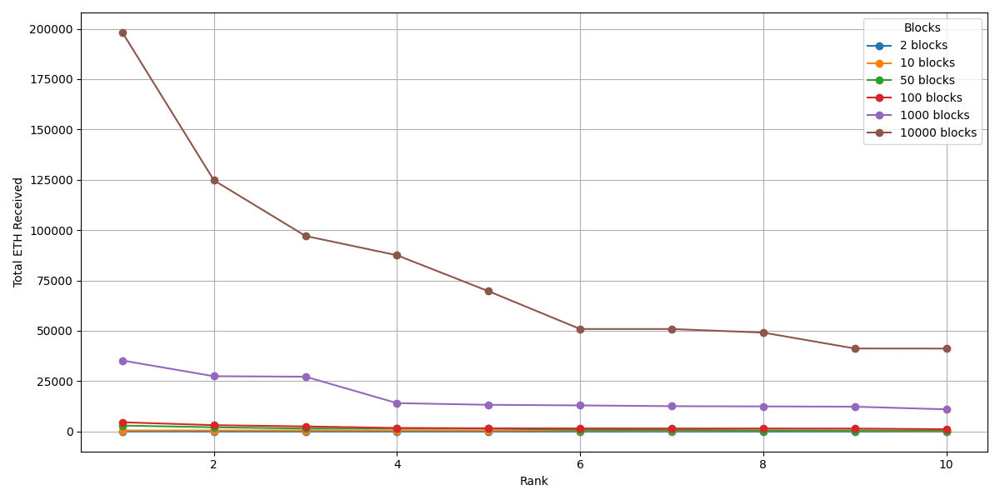
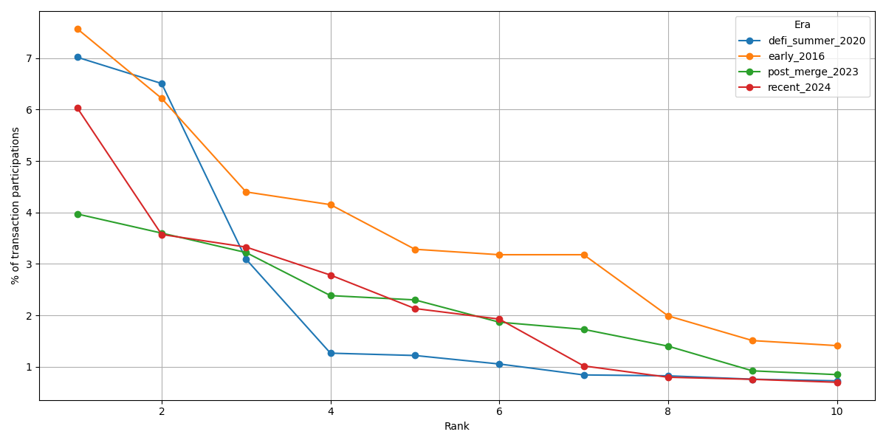
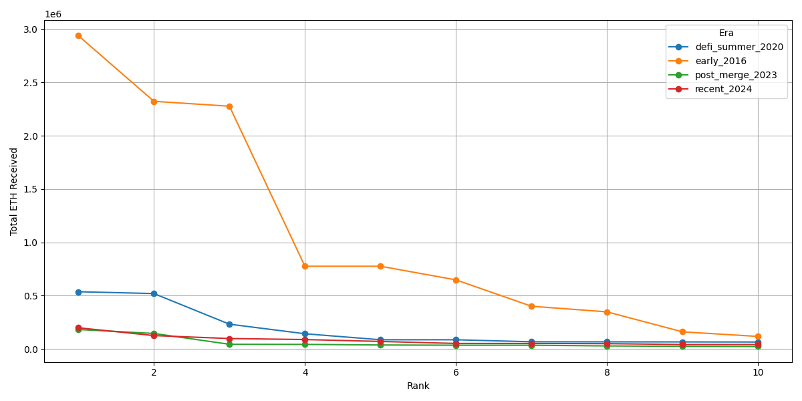

# Blockchain Trajectories in Graph Databases: A Neo4j-Based Model for Ethereum Transaction Analytics

Francisco Javier Moreno Arboleda · Juan Esteban Mejía Espejo · Georgia Garani

## Abstract

Blockchain platforms generate large volumes of interconnected transactional data,
whose analysis can reveal important patterns of account activity, value transfer,
and user interaction. This paper proposes a graph database model for representing
and analyzing Ethereum blockchain data. The proposed model captures blocks,
accounts, external transactions, and internal transactions as graph nodes, while
relationships represent temporal block succession, transaction recording, sender
and receiver participation, and the decomposition of external transactions into
internal transactions. By interpreting the blockchain as a trajectory of
consecutive blocks, the model enables trajectory-style analytics over selected
temporal windows. The model was implemented in Neo4j, using Ethereum data
collected through Google BigQuery's public Ethereum dataset, and evaluated through
Cypher queries over cumulative block ranges spanning 2 to 10,000 blocks and across four distinct eras of
Ethereum's history (2016, 2020, 2023, and 2024). The queries analyze account
activity, sender–receiver relationships, transaction volumes, and statistical
properties of external and internal transactions. The experimental results show
that the proposed graph representation can effectively identify highly active
accounts, recurrent sender–receiver pairs, and key intermediaries such as the
Wrapped Ether contract, and that these patterns are stable across nearly four orders
of magnitude of window size. At the ten-thousand-block
scale (over 1.5 million external and 0.8 million internal transactions for the 2024
window) all queries execute in seconds once expressed in a single-traversal form.
The cross-era comparison further reveals the structural evolution of the network:
the number of transactions per block, the proportion of internal transactions, and
the identity of the dominant intermediaries all change markedly from 2016 to 2024,
with Wrapped Ether emerging and rising to dominance over this period. The findings
demonstrate the suitability of graph databases for blockchain transaction analysis
at scale and provide a foundation for future work on anomaly detection, community
discovery, and real-time graph-based monitoring.

**Keywords:** Blockchain analytics; Ethereum; Graph databases; Neo4j; Cypher
queries; External transactions; Internal transactions; Transaction networks;
Account activity; Blockchain trajectories

## 1. Introduction

Blockchain technology has revolutionized several sectors (Tschorsch & Scheuermann,
2016) due to its ability to provide a decentralized, immutable, and secure ledger
for transactional data. Blockchain databases (DBs) usually store millions of
transactions; e.g., as of late December 2025 Bitcoin has more than 1.2 billion
transactions and Ethereum more than 3.2 billion. This offers an opportunity to
perform data analysis, which helps us understand the relationships and dynamics
among their users (participants).

Graph DBs (GDBs) stand out for their ability to manage graphs and query the
relationships between their nodes. Unlike relational DBs (RDBs), which use
relations (informally, tables) to store data, GDBs represent data as nodes and the
relationships between them as edges (edges can also carry data), facilitating the
formulation of neighborhood queries, e.g., finding the nodes connected to a given
node. This capability is well suited for modeling a blockchain DB, where blocks,
transactions, and user accounts are interconnected, i.e., they form a network (a
graph). Thus, the convergence of blockchain and GDBs offers opportunities for
analyzing blockchain data modeled as a graph: representing a blockchain DB in a GDB
not only enables visualization of the network's structure, but also facilitates the
formulation of queries to detect patterns, explore relationships between users, and
gain valuable insights about user behavior.

However, blockchain data analysis using GDBs remains relatively underexplored (see
Section 2). The few existing studies, such as Estupiñán (2020) and Lin et al.
(2020), mainly address address clustering, performance evaluation, and link
prediction. The main contribution of this study lies in the analysis of the
Ethereum network using graph queries to identify patterns and relationships among
user accounts. Furthermore, the study introduces a formal graph model for the
Ethereum blockchain and examines the composition and interrelation of external and
internal transactions, an aspect not usually detailed in related work. The analysis
spans cumulative windows from 2 to 10,000 consecutive blocks and four distinct eras
of Ethereum's history, in order to study how the observed interaction patterns
evolve over time.

For the representation of a blockchain DB in a GDB, this work adopts a
trajectory-based graph perspective. A blockchain can naturally be modeled as a
trajectory, namely an ordered sequence of transactions anchored to a temporal
backbone formed by the sequence of blocks, where each block contains a set of
transactions. Under this representation, nodes correspond to blocks, transactions,
and user accounts, while edges represent (i) the temporal succession of blocks,
(ii) the participation of accounts as senders or receivers in transactions, and
(iii) the decomposition of external transactions into internal transactions. This
perspective enables trajectory-style analytics, such as the analysis of
sender–receiver behavior over a specific interval of blocks, and differs from a
conventional temporal-graph representation in that the ordered sequence of blocks
is the primary temporal backbone rather than a per-edge timestamp attribute.

The remainder of the paper is organized as follows. Section 2 reviews related work
on trajectory modeling and blockchain analysis using GDBs. Section 3 introduces the
proposed model. Section 4 presents the experimental setup and results. Section 5
discusses the model's capabilities, strengths, and limitations in light of the
scaled and cross-era experiments. Section 6 concludes and outlines future work.

## 2. Related work

This section reviews existing studies on trajectory modeling and blockchain analysis
based on graph databases.

### 2.1 Trajectory modeling with GDBs

In Bakkal et al. (2017), trajectories are modeled and implemented in Neo4j to build
a ridesharing (carpooling) system, using the Neo4j Spatial library for spatial
querying/indexing and GraphAware Neo4j TimeTree for second-level time
representation. A trajectory is represented by a set of nodes (user, moment in
time, position, and a link node connecting them); each link node is a point within
a trajectory. Experiments on the Geolife dataset (182 users, 18,000 trajectories)
demonstrate feasibility, though the results are not analyzed for broader
conclusions.

Khan et al. (2017) present a performance comparison between a RDBMS (Oracle 11g)
and a GDBMS (Neo4j 3.0.3 Community) on healthcare data. Neo4j outperforms Oracle,
with the gap widening as the dataset grows, owing to Neo4j's native handling of
relationships versus Oracle's join operations.

Gómez, Kuijpers & Vaisman (2019) model semantic trajectories (STs) as a graph in
Neo4j and compare against a PostgreSQL implementation, defining aggregation
hierarchies for POI and temporal dimensions. GDB queries execute 1.2–7× faster than
their relational counterparts, except for transitive-closure queries, which perform
better relationally.

Tamilmani & Stefanakis (2019) model and analyze Semantically Enriched Simplified
Trajectories (SESTs) in Neo4j, applying the SED criterion and SELF structure for
semantics-preserving simplification, and focus on shortest/longest-trajectory and
collision-region queries.

Karim et al. (2021) propose a framework for collecting, storing, and analyzing
pedestrian trajectories using PostGIS and Neo4j with spatial APIs, modeling
trajectory events, intents, and activities via a UML class diagram, though without
Neo4j implementation details or analytical queries.

Xue et al. (2022) propose CoGAT, a graph-based model in Neo4j for Argo float
trajectories, modeling parking/surface segments and subtrajectories; it achieves
higher computational efficiency than an Oracle Spatial baseline (OSATDB).

Elayam et al. (2022) introduce a hierarchical graph-based model for mobility data,
evaluated on the European maritime network, combining MovingPandas, Uber H3 spatial
indexing, and Neo4j to support analysis at micro, meso, and macro levels.

### 2.2 Blockchain analysis with GDBs

Estupiñán (2020) analyses Ethereum-blockchain modelling, loading, and querying with
Neo4j, JanusGraph, and DSE Graph, focusing on address-clustering (airdrop
multi-participation and deposit-address re-use, per Victor 2019). Two graph models
(transaction-as-node and transaction-as-edge) are implemented; Neo4j and DSE Graph
perform best with transaction-as-node, and indexing is decisive for query
performance.

Lin et al. (2020) model Ethereum transaction records as a temporal weighted
multidigraph (TWMDG) and introduce temporal random-walk strategies for link
prediction, outperforming traditional random-walk techniques on real Ethereum data.

### 2.3 Positioning

Most previous works are trajectory-centric, focusing on spatial/temporal features,
performance comparisons in Neo4j, or semantic simplification, rather than on
blockchain analytics in a GDB. Although Ethereum has been modeled as a TWMDG for
link prediction (Lin et al., 2020) and as a graph for address-clustering and
query-performance studies (Estupiñán, 2020), limited attention has been given to
formal graph-based models supporting broader analytical processing of blockchain
data. The proposed contribution addresses this gap with a formal model enabling
graph-style analytical queries over Ethereum data — including both external and
internal transactions — and demonstrates it at scale (up to 10,000 blocks) and
across four eras. Table 1 summarizes the analyzed works and their limitations.

## 3. Model definition

The proposed model is designed around the notion of a blockchain trajectory: an
ordered sequence of consecutive blocks that defines the temporal progression of
blockchain activity. Each block is a trajectory point, and the transactions
recorded in that block are the activity associated with that point. This
interpretation enables the analysis of Ethereum behavior over block windows while
preserving the relationships among blocks, accounts, external transactions, and
internal transactions.

Ethereum distinguishes two transaction types. An **external transaction** is a
user-initiated action submitted by an Externally Owned Account (EOA), recorded
directly in a block and uniquely identified by a transaction hash. An **internal
transaction** is a value transfer or contract call triggered during the execution
of an external transaction through smart-contract code; it is identified by its
parent external transaction together with a sequential number.

### 3.1 Block node
Attributes: `blockNumber` (the block height, unique) and `dateCreation` (creation
timestamp). Datatype: `NblockDt = (blockNumber, dateCreation)`, with
`blockNumber ∈ ℕ`, `dateCreation ∈ Timestamp`.

### 3.2 Transaction node
Attributes: `transactionHash` (unique id of an external transaction; empty for
internal), `isInternalTransaction` (Boolean), `value` (ETH transferred),
`sequenceId` (per-parent counter for internal transactions), and
`parentTransactionHash` (for internal transactions).
Datatype: `NtransactionDt = (transactionHash, isInternalTransaction, value,
sequenceId, parentTransactionHash)`.

### 3.3 Account node
Attributes: `address` (unique id) and `isContract` (Boolean: contract vs EOA).
Datatype: `NaccountDt = (address, isContract)`.

> The account model deliberately carries only `address` and `isContract`. A balance
> attribute is intentionally excluded: none of the analytical queries depend on it,
> and a current-balance value would not correspond to an account's state during the
> analyzed block window, so it is not meaningful for the historical, window-based
> analysis pursued here. Block nodes likewise retain only number and timestamp.

### 3.4 Edges
The model defines: **previous block** (`currentBlockNumber = previousBlockNumber +
1`); **recorded in** (external transaction → containing block); **sent by** /
**received by** (external transaction ↔ sender/receiver account); **internal
transaction** (external transaction → its internal transactions, keyed by
`parentTransactionHash` + `sequenceId`); and **internal sent by** / **internal
received by** (internal transaction ↔ sender/receiver account). Constraints and
datatypes are illustrated in Figures 2 and 3.

## 4. Experiments

The experiments were conducted on a MacBook Air (Apple M4, 16 GB RAM, macOS Tahoe
26.3), with the GDB managed by a local instance of Neo4j Community Edition version
2026.01.3.

### 4.1 Data acquisition

Data were obtained from the public `crypto_ethereum` dataset on Google BigQuery,
which mirrors the Ethereum blockchain and is updated continuously. Four tables were used: `blocks`
(number, timestamp), `transactions` (external transactions), `traces` (internal
transactions, i.e. message calls generated during contract execution), and
`contracts` (deployed contract accounts). For a given block window, a small set of
queries retrieves all blocks, external transactions, and internal transactions,
together with the participating accounts. An account is classified as a smart
contract when it appears in the `contracts` table with a deployment block no later
than the end of the window — a point-in-time classification consistent with the
analyzed window. Internal transactions are operationalized as successful,
value-transferring sub-calls (traces with a non-empty trace address and non-zero
value); purely zero-value message calls are thus excluded. This understates the
absolute count of internal calls, but the criterion is applied uniformly across all
eras and window sizes, so the internal-to-external ratios reported in Section 4.4
remain comparable. Because the BigQuery tables are partitioned by day on their
timestamp column, the extraction queries constrain both the block-number range and
the corresponding block-timestamp range so that only the relevant daily partitions
are scanned; this reduces the data processed for a 100-block window from several
terabytes to a few gigabytes.

The retrieved rows are written to Neo4j in batches using parameterized `UNWIND`
statements, with uniqueness constraints declared in advance on `Block.number`,
`ExternalTransaction.transactionHash`, and `User.address`, and a composite index on
the internal-transaction key. With this design the dominant cost is neither data
acquisition nor writing, and the analysis scales to windows of up to ten thousand
blocks.

### 4.2 Experimental design

Queries are evaluated over cumulative, nested block ranges: **2, 10, 50, 100,
1,000, and 10,000** consecutive blocks.
The same ladder is evaluated over four **eras** drawn from structurally distinct
periods of Ethereum's history:

| Era | Start block | Date (10k-block span) | Character |
|-----|-------------|-----------------------|-----------|
| Pre-DeFi (2016)    | 2,000,000  | Aug 02–04, 2016 | sparse activity, few internal transactions, prior to WETH |
| DeFi Summer (2020) | 10,700,000 | Aug 20–22, 2020 | rise of WETH/decentralized exchanges, PoW gas competition |
| Post-Merge (2023)  | 17,000,000 | Apr 07–09, 2023 | proof-of-stake, 12-second blocks, MEV |
| Post-Dencun (2024) | 20,512,878 | Aug 12–13, 2024 | post-Dencun, L2-oriented activity |

The block count is held fixed across eras (the corresponding time spans are
reported above); because block-production rates and per-block transaction counts
differ across eras, the transaction volume for a fixed block count varies, and this
variation is itself part of the findings. All queries are executed unchanged in
every era. Queries are organized into four groups: (i) account activity by ETH
transferred, (ii) account activity by number of transactions, (iii) relationships
between accounts, and (iv) general transaction statistics. The complete per-run and
comparison outputs are in `data/results/` and `data/output/`.

The external-transaction node is labelled `ExternalTransaction`. For example, the
ten accounts that received the most ETH:

```cypher
MATCH (u:User)-[:RECEIVED_BY]->(tx)
WITH u.address AS account,
     CASE WHEN tx:ExternalTransaction THEN tx.value
          WHEN tx:InternalTransaction THEN tx.amount END AS received_amount
RETURN account, SUM(received_amount) AS total_received
ORDER BY total_received DESC LIMIT 10
```

### 4.3 Scaling within a single era (post-Dencun, 2024)

At 1,000 and 10,000 blocks (from block 20,512,878) the model operates efficiently
at scale and the patterns identified on small samples persist. The 10,000-block window comprises
**1,530,170 external transactions, 849,527 internal transactions, and 532,348
distinct accounts** (about 5.3% smart contracts), a graph of ~2.9M nodes and ~5.8M
relationships. All queries execute in a few seconds on this graph once the
total-participation query is expressed in its single-traversal form (Section 4.6).



**Concentration is stable across window sizes.** The Wrapped Ether contract
(0xc02aaa39…756cc2) is the single most active account by overall transaction
participation at every window size, and its share is essentially flat as the window
grows: 7.00%, 6.03%, 5.76%, 5.92%, 5.96%, and 6.03% of all transaction
participations at 2, 10, 50, 100, 1,000, and 10,000 blocks respectively (Query
4.2.3; a participation is one sender or one receiver role in a transaction). If
anything the share is marginally highest at the smallest window. The Tether (USDT)
contract (0xdac17f95…831ec7) and the aggregator 0x3fc91a3a…2b7fad occupy the second
and third positions at every scale, swapping ranks 2↔3 between the smallest and
largest windows but never leaving the top three. The centrality of the key
intermediaries is thus a robust property of the network, well defined already at
small samples and neither sharpening nor dissipating as the window grows across
nearly four orders of magnitude.


**Value distributions.** For external transactions the median transferred value is
0 ETH at every window size (Query 4.4.1), confirming that a
large fraction of external transactions are contract interactions carrying no direct
ETH transfer. The mean is dominated by rare large transfers: the maximum is already
~17,540 ETH by 1,000 blocks (17,568 ETH at 10,000) while the 75th percentile stays
~0.02–0.05 ETH. For internal transactions the mean amount is outlier-driven and
non-monotonic across the ladder (0.55, 6.07, 3.42, 2.71, 2.38, 1.92 ETH at 2, 10,
50, 100, 1,000, 10,000 blocks) while the median stays low and stable (~0.04 ETH) —
i.e. most internal transfers are small and a few large ones move the mean.

### 4.4 Cross-era comparison

Running the same 10,000-block ladder in four eras shows how Ethereum's interaction
structure has changed. Holding the block count fixed, the eras differ sharply:

| Era (start block) | External txs | Internal txs | Accounts | Contract share | ext-tx / block | internal/external | Most-received account (rank 1) | WETH rank |
|-------------------|-------------:|-------------:|---------:|---------------:|---------------:|------------------:|--------------------------------|:----------|
| Pre-DeFi 2016 (2,000,000)    |    80,796 |  16,133 |  28,723 | 7.2% |   8.1 | 0.20 | 0xaa1a…6444 (contract) | absent |
| DeFi Summer 2020 (10,700,000)| 1,878,933 | 385,042 | 590,445 | 5.3% | 187.9 | 0.20 | 0x7a25…488d — Uniswap V2 Router | 2 |
| Post-Merge 2023 (17,000,000) | 1,301,965 | 739,050 | 524,965 | 5.8% | 130.2 | 0.57 | 0x8358…28fe | 2 |
| Post-Dencun 2024 (20,512,878)| 1,530,170 | 849,527 | 532,348 | 5.3% | 153.0 | 0.56 | 0xc02a…56cc2 — Wrapped Ether | 1 |


1. **Densification.** External transactions per block rise from about 8 in 2016 to
   130–190 in the modern eras (roughly twentyfold), so a fixed 10,000-block window
   represents ~81k transactions in 2016 but ~1.3–1.9M in 2020–2024. The DeFi-Summer
   window has the highest raw throughput (187.9 tx/block), consistent with the gas
   competition of that period. Block count and transaction volume are therefore not
   interchangeable across eras — the block-trajectory model fixes the former and
   reports the latter.
2. **Rise of contract complexity.** The ratio of value-transferring internal
   transactions to external transactions is flat at 0.20 in both 2016 and 2020 but
   jumps to ~0.57 in 2023 and 2024: modern external transactions each trigger far
   more value-bearing internal transfers, reflecting the shift from simple transfers
   and first-generation DeFi toward more deeply composed smart-contract interactions
   (staking, MEV, multi-hop routing). Because the measured ratio counts only
   value-transferring calls (§4.1), it is a conservative lower bound on the true
   growth in internal-call complexity — zero-value message calls, common in routers
   and aggregators, are excluded. The contract share of accounts stays in a narrow
   5–7% band, so the growth is in *activity per contract*, not in the proportion of
   contracts.
3. **Emergence of Wrapped Ether.** WETH is entirely absent from the 2016 window
   (deployed December 2017). By 2020 it is the second most-received account, behind
   the Uniswap V2 Router (0x7a250d…488d), the defining contract of DeFi Summer; it
   remains second in 2023 and becomes the single most-received account in 2024. The
   "key intermediary" the single-era analysis highlights is thus not a fixed feature
   of the network but one that emerged and rose to dominance. Era-specific
   intermediaries are also visible — e.g. the Beacon-chain deposit contract
   (0x0000000021…705fa) is the second most-received account in 2024, reflecting
   post-Merge staking flows.





Cross-era comparison charts and pivot tables for every query and cut-off are in
`data/output/cross_era_<n>/`; within-era ladders are in `data/output/<era>/`. The main result tables are collected in Appendix A.

### 4.5 Relationships between accounts and statistics

The sender–receiver pair queries (Query 4.3) and the transaction-statistics queries
(Query 4.4) were executed for all eras and cut-offs. The persistent presence of
specific sender–receiver pairs across window sizes indicates stable behavioural
patterns and identifies high-traffic corridors and key
intermediaries; the cross-era view shows these corridors themselves shift with the
dominant applications of each period (e.g. Uniswap routing in 2020, staking flows in
2024). Detailed tables are provided under `data/output/`.

### 4.6 Query scalability note

The total-participation query (4.2.3), as originally written, performs two
`OPTIONAL MATCH` traversals over an account's sent and received edges before
aggregating, materializing the cross-product of the two edge sets per account. For
hub accounts this is prohibitive (WETH has ≈128k sent and ≈159k received edges at
10,000 blocks, i.e. ~2×10^10 intermediate rows) and the query does not complete.
Rewriting it to aggregate the two traversals in separate stages — the
single-traversal reformulation — returns identical results in about two seconds. This is the only query requiring
reformulation to reach 10,000 blocks; the remaining queries scale directly.

## 5. Discussion: capabilities, strengths, and limitations

The scaled and cross-era experiments allow a more critical assessment of what the
proposed model enables — and where it does not — more clearly than a single-era,
small-scale analysis could.

### 5.1 Analytical capabilities demonstrated

| Capability | How the model supports it | Evidence from the experiments |
|------------|---------------------------|-------------------------------|
| Rank the most active accounts (by value and by participation) | `SENT_BY`/`RECEIVED_BY` aggregation over transaction nodes | WETH, USDT and a small set of aggregators identified as stable leaders (§4.3) |
| Detect recurrent sender–receiver corridors | pair pattern `(:User)-[:SENT_BY]->(tx)<-[:RECEIVED_BY]-(:User)` | Uniswap-router-centred corridors in 2020, staking flows in 2024 (§4.4–4.5) |
| Separate user↔contract from user↔user flows | `isContract` on `User` + pair queries | ~5–7% of accounts (contracts) mediate most activity across all eras |
| Decompose external into internal transactions | distinct `ExternalTransaction`/`InternalTransaction` labels + `HAS_INTERNAL_TRANSACTION` | value-transferring internal/external ratio 0.20→0.57 across eras — invisible to external-only models |
| Windowed ("trajectory") analysis | cumulative block ranges over the block backbone | stabilization curves 2→10,000 blocks (§4.3) |
| Compare across time with no new queries | era-agnostic schema; identical 14 queries | WETH's emergence and the complexity jump (§4.4) |

### 5.2 Strengths (where the model is useful)

- **Locality and expressiveness.** Neighborhood, pair, and participation queries map
  directly to graph traversals and run in seconds even on the 10,000-block 2024
  graph (~2.9M nodes, ~5.8M relationships). The questions the model answers best are
  exactly the relational ones that are awkward in a relational schema.
- **Portability across time.** The same schema and the same fourteen queries ran
  unchanged over windows spanning 2016 to 2024; the cross-era study required *zero*
  new queries. This makes the model well suited to longitudinal, comparative
  blockchain studies, not just single-snapshot analysis.
- **The internal-transaction modeling earns its place.** The external/internal
  distinction — rarely modeled explicitly in related work — is what surfaced the
  post-Merge tripling of contract-mediated activity (Figure 6, right). This is the
  clearest example of a finding the model enables that a transactions-as-edges graph
  could not express.
- **Small samples are representative — for structure.** The ranking of dominant
  intermediaries is already stable by ~100–1,000 blocks; the 10,000-block runs
  confirmed rather than overturned it. This shows that representative behavior can
  be extracted from modest samples. Larger windows refine the *magnitudes* of
  value-based metrics (e.g. maximum transfers), while the participation-share
  concentration itself stays flat across scales (§4.3).

### 5.3 Limitations (where it struggles)

- **Uneven query scalability.** Global aggregations that fan out over high-degree
  hubs can blow up: the total-participation query built a cartesian product on
  WETH's ~287k edges and did not complete at 10,000 blocks until reformulated
  (78 min → 2 s, §4.6). The model is fast for local and pair queries but naive
  global queries need careful, sometimes non-obvious, formulation — a genuine cost
  of the approach, not merely an implementation detail.
- **Operational cost at scale.** Bulk loading and, especially, bulk deletion require
  capacity planning: a single-transaction wipe of the 2.9M-node graph exhausted the
  heap and had to be batched. Beyond ~10^7 elements the GDB stops being "just fast."
- **The temporal backbone is under-exploited.** `PREVIOUS_BLOCK` is loaded and gives
  the model its trajectory framing, yet almost none of the analytical queries
  actually traverse the block chain; the trajectory is currently more organizational
  than query-driving. Making the backbone earn its place (e.g. inter-block flow or
  persistence queries) is an open opportunity.
- **Block count is not volume-comparable across eras.** A fixed 10,000-block window
  is ~81k transactions in 2016 but ~1.9M in 2020 (Figure 6, left). Cross-era claims
  must therefore always report volume alongside block count; the block-trajectory
  abstraction, while clean, hides this by design.
- **No block-time economic state.** Dropping `balance` simplified ingestion at no
  cost to the present queries, but the model consequently cannot answer
  wealth/holdings questions without adding block-time state.
- **Each era is a single ~2-day window (n = 1).** Every era is one contiguous
  10,000-block window (~1.4–1.9 days at 12–14 s/block). The cross-era "evolution"
  findings (densification, the internal/external ratio jump, WETH's rise, the
  Figure 7 profiles) are therefore single-window snapshots, not statistically
  estimated era means: a day-specific event (a large airdrop, NFT mint, exploit, or
  MEV episode) could move a window's ratios or top recipients, and three of the four
  windows fall in August. The cross-era differences should be read as indicative of
  era character; attaching confidence would require several windows per era. (The
  within-era ladder, by contrast, does vary the sample — across block-count — and
  shows stability there.)
- **Contract classification is a slight undercount.** An account is labeled a
  contract only if it appears in BigQuery's `contracts` table with a deployment
  block within the window; contracts created in-window but not otherwise referenced,
  precompiles, and L2 alias/system addresses are therefore counted as EOAs. This
  makes the reported contract share (5–7%) a mild lower bound; it does not affect the
  value/participation rankings.

### 5.4 Were the two new axes worth it?

- **Scaling to 10,000 blocks — worth it, with diminishing returns for ranking.**
  For *identifying* the key players, returns diminish beyond a few hundred blocks;
  for *distributional/magnitude* claims and for *stress-testing* the model, returns
  increase — the scale is precisely what exposed the query-scalability limitation
  (§4.6) and confirmed that the concentration of key intermediaries is stable across
  nearly four orders of magnitude of window size, rather than a small-sample artifact. The
  value is credibility and the surfacing of a real limitation, more than new rankings.
- **Cross-era comparison — the most valuable addition.** It converted static
  single-era observations ("WETH is a key intermediary") into evolutionary findings
  ("WETH emerged from non-existence in 2016 to dominance in 2024; contract
  complexity tripled after the Merge; the network densified ~20×"), and it doubled as
  a portability test of the model. Its costs — 4× the data/compute and the
  block-count comparability caveat — are modest against that. If only one of the two
  extensions were kept, the cross-era axis is the one that most enlarges what the
  model can say.

## 6. Conclusions and future work

This work proposed a GDB model for representing Ethereum blockchain transactions,
distinguishing external and internal transactions and defining nodes for accounts,
blocks, and transactions together with their relationships. The model was
implemented with a BigQuery-based ingestion pipeline and batched loading, which
allowed the analysis to scale to 10,000 blocks and to be replicated across four eras
of Ethereum's history.

The results are consistent and clear. Within a single era,
behavioural patterns are stable as the analyzed window grows: the Wrapped Ether
contract's share of transaction participations holds at ~6% between 2 and 10,000
blocks, and the same small set of intermediaries dominates at every scale. Across eras, the model reveals structural evolution that a single-era
study cannot: a roughly twentyfold densification in transactions per block from
2016 to the modern network, a near-tripling of the internal-to-external transaction
ratio after the Merge, and the emergence of Wrapped Ether from non-existence in 2016
to the dominant intermediary in 2024. These results demonstrate that graph databases
are suitable for blockchain transaction analysis at realistic scale, and that the
block-trajectory representation supports both within-era stabilization analysis and
cross-era comparison.

Future work may (i) extend the model with additional block- and transaction-level
metadata (base fee, miner/validator, gas used, maximum fee); (ii) generalize the
schema to other blockchains to compare behavioural patterns across platforms; (iii)
integrate streaming and near-real-time ingestion for continuous analytics; (iv)
explore anomaly detection (e.g. wash trading), community discovery, and activity
prediction; and (v) define high-level operators to simplify the formulation of
blockchain analytical queries, since complex Cypher queries — as the
total-participation case in Section 4.6 shows — can be both hard to write and
sensitive to scale.

## References

*(Bakkal et al. 2017; Elayam et al. 2022; Gómez,
Kuijpers & Vaisman 2019; Karim et al. 2021; Khan et al. 2017; Lin et al. 2020;
Tamilmani & Stefanakis 2019; Xue et al. 2022; Estupiñán 2020; Said et al. 2021;
Kiffer et al. 2018; Victor & Weintraud 2021; Victor 2019; Tschorsch & Scheuermann
2016.)*

Data source:
- Google BigQuery public dataset `bigquery-public-data.crypto_ethereum` (Ethereum
  ETL), used for all data acquisition in Section 4.

## Appendix A — Result tables

Curated results referenced in Section 4. Full per-run tables (all queries, all cut-offs and eras) and comparison pivots are also available under `data/results/<era>/<n>/` and `data/output/`.

The ETH totals in Tables A.1 and A.6 sum external-transaction value and internal-transaction amount over incoming edges, so ETH forwarded through a contract may be counted at more than one hop; these tables are intended for ranking, not exact fund accounting.

### Table A.1 — Top-ten accounts by total ETH received and sent (post-Dencun 2024, 10,000 blocks)

| Rank | Account (received) | ETH received | Account (sent) | ETH sent |
|-----:|--------------------|-------------:|----------------|---------:|
| 1 | 0xc02a…6cc2 | 198,186.49 | 0xc02a…6cc2 | 150,524.44 |
| 2 | 0x0000…05fa | 124,741.00 | 0x28c6…1d60 | 121,171.97 |
| 3 | 0xb5d8…f511 | 97,121.07 | 0xb5d8…f511 | 103,128.36 |
| 4 | 0x28c6…1d60 | 87,524.79 | 0xae7a…fe84 | 95,596.98 |
| 5 | 0xa9d1…3e43 | 69,661.62 | 0x889e…f9b1 | 73,291.14 |
| 6 | 0x1714…17eb | 50,906.99 | 0xa9d1…3e43 | 67,164.87 |
| 7 | 0xae7a…fe84 | 50,906.99 | 0xceb6…66ea | 61,343.35 |
| 8 | 0x8934…b2b9 | 49,121.18 | 0x8934…b2b9 | 49,121.18 |
| 9 | 0xc364…fe88 | 41,233.48 | 0xf2f3…0d60 | 45,234.17 |
| 10 | 0xceb6…66ea | 41,177.70 | 0xfddf…2999 | 44,672.00 |

### Table A.2 — Top-ten accounts by transaction-participation percentage (post-Dencun 2024, 10,000 blocks)

| Rank | Account | Sent tx | Received tx | Total participation (%) |
|-----:|---------|--------:|------------:|------------------------:|
| 1 | 0xc02a…6cc2 | 127,869 | 159,322 | 6.03 |
| 2 | 0x3fc9…7fad | 63,351 | 106,654 | 3.57 |
| 3 | 0xdac1…1ec7 | 0 | 158,362 | 3.33 |
| 4 | 0x7a25…488d | 57,572 | 74,887 | 2.78 |
| 5 | 0x3328…9c49 | 62,174 | 39,332 | 2.13 |
| 6 | 0x80a6…5d9e | 53,603 | 38,130 | 1.93 |
| 7 | 0xa0b8…eb48 | 0 | 48,392 | 1.02 |
| 8 | 0x1111…0582 | 14,653 | 23,269 | 0.80 |
| 9 | 0x3a10…981f | 22,835 | 13,160 | 0.76 |
| 10 | 0xa69b…e78c | 20,955 | 12,285 | 0.70 |

### Table A.3 — External-transaction value statistics across the block-count ladder (post-Dencun 2024, ETH)

| Blocks | Average | Minimum | Maximum | P25 | Median | P75 |
|-------:|--------:|--------:|--------:|----:|-------:|----:|
| 2 | 0.1225 | 0.0000 | 7.4514 | 0.0000 | 0.0000 | 0.0223 |
| 10 | 0.4178 | 0.0000 | 199.0352 | 0.0000 | 0.0000 | 0.0300 |
| 50 | 0.8540 | 0.0000 | 1,462.0000 | 0.0000 | 0.0000 | 0.0200 |
| 100 | 1.1449 | 0.0000 | 2,505.7346 | 0.0000 | 0.0000 | 0.0206 |
| 1,000 | 1.9498 | 0.0000 | 17,536.8474 | 0.0000 | 0.0000 | 0.0450 |
| 10,000 | 1.1807 | 0.0000 | 17,568.3202 | 0.0000 | 0.0000 | 0.0292 |

### Table A.4 — Internal-transaction amount statistics across the block-count ladder (post-Dencun 2024, ETH)

| Blocks | Average | Minimum | Maximum | P25 | Median | P75 |
|-------:|--------:|--------:|--------:|----:|-------:|----:|
| 2 | 0.5514 | 0.0000 | 50.0000 | 0.0109 | 0.0466 | 0.1178 |
| 10 | 6.0682 | 0.0000 | 512.0000 | 0.0063 | 0.0424 | 0.1507 |
| 50 | 3.4190 | 0.0000 | 1,462.0000 | 0.0063 | 0.0419 | 0.1500 |
| 100 | 2.7065 | 0.0000 | 1,462.0000 | 0.0050 | 0.0380 | 0.1384 |
| 1,000 | 2.3793 | 0.0000 | 4,500.0000 | 0.0115 | 0.0626 | 0.2040 |
| 10,000 | 1.9225 | 0.0000 | 28,382.1031 | 0.0050 | 0.0429 | 0.1874 |

### Table A.5 — Top-ten sender→receiver pairs (post-Dencun 2024, 10,000 blocks)

| Rank | Pair (by tx count) | Tx count | Pair (by ETH) | ETH transferred |
|-----:|--------------------|---------:|---------------|----------------:|
| 1 | 0xae2f…ae13→0x1f2f…f387 | 8,097 | 0xb5d8…f511→0xa9d1…3e43 | 60,722.48 |
| 2 | 0x0000…cbe0→0x68d3…0dc9 | 5,303 | 0x28c6…1d60→0xdfd5…963d | 32,049.43 |
| 3 | 0x0000…4a5f→0x68d3…0dc9 | 5,301 | 0xcfec…9ff5→0x0000…05fa | 24,544.00 |
| 4 | 0x4634…9758→0xdac1…1ec7 | 3,770 | 0x28c6…1d60→0x21a3…5549 | 21,588.05 |
| 5 | 0x7830…6f43→0xa9d1…3e43 | 3,272 | 0x28c6…1d60→0x4976…2327 | 20,369.97 |
| 6 | 0x9379…7551→0x68d3…6fbf | 2,896 | 0x28c6…1d60→0x56ed…b17f | 19,567.25 |
| 7 | 0x89e5…7c40→0xdac1…1ec7 | 2,716 | 0xfae1…4cf6→0xcd53…ca7b | 17,568.32 |
| 8 | 0x355d…09d5→0xaf12…d58e | 2,635 | 0xbe9f…696b→0xceb6…66ea | 17,536.85 |
| 9 | 0x4481…5af8→0x68d3…6fbf | 2,610 | 0xfaff…4497→0xceb6…66ea | 17,513.06 |
| 10 | 0x56ed…b17f→0xdac1…1ec7 | 2,283 | 0xceb6…66ea→0x930f…c785 | 17,491.36 |

### Table A.6 — Top-five accounts by total ETH received, per era (10,000-block windows)

| Rank | 2016 | 2020 | 2023 | 2024 |
|-----:|------|------|------|------|
| 1 | 0xaa1a…6444 (2,938,082.38) | 0x7a25…488d (536,109.63) | 0x8358…28fe (181,792.00) | 0xc02a…6cc2 (198,186.49) |
| 2 | 0x32be…2d88 (2,322,598.73) | 0xc02a…6cc2 (519,004.51) | 0xc02a…6cc2 (144,639.95) | 0x0000…05fa (124,741.00) |
| 3 | 0xbfc3…5bdd (2,276,719.06) | 0x3f5c…f0be (231,722.33) | 0xef1c…bf6b (43,212.43) | 0xb5d8…f511 (97,121.07) |
| 4 | 0x04c9…3ee5 (775,333.68) | 0x8358…28fe (141,912.00) | 0x28c6…1d60 (42,099.06) | 0x28c6…1d60 (87,524.79) |
| 5 | 0xd5c6…06b7 (775,333.00) | 0xfa52…40b3 (85,549.30) | 0xc364…fe88 (36,557.31) | 0xa9d1…3e43 (69,661.62) |
